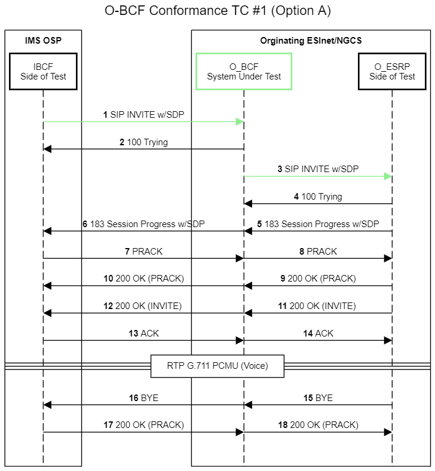

## Basic Call

### Test Case: 1

#### Description:
This use case tests the OSP-Facing BCF (O-BCF) when providing a basic call.

-   The test system sends messages to and receives responses from the O-BCF's OSP interfaces.

-   The test system receives messages from and sends responses to the O-BCF's ESRP interfaces.

-   The tool will simulate elements on both sides of the O-BCF.

-   The base flow is a call with early media.

#### Interfaces/Functional Elements:

-   OSP-Facing BCF

#### Advance Pre-Conditions:

-   No active calls

-   Configure the BCF to route calls to the corresponding test endpoint.

-   O-BCF TCP port 5060

-   Operator of the device under test to specify what a legal uri for the route header field that will work in the environment.

#### Pre-Test Sequence:

-   911 call is sent to an O-BCF by an OSP

-   Fixed origination call

#### Variations:

1.  O-BCF TCP port 5061 with mutual TLS

2.  Mutual TLS with good server-side certificate bad client-side
    certificate

3.  Cause the TLS connection to fail and then the test system would fall
    back to TCP

    1.  Try TCP without TLS

    2.  Try UDP

4.  Call with all required headers

5.  Call with some or all of the required headers not present

6.  Call with some of the optional headers provided

7.  Call without early media

8.  Call with provisional messaging off

9.  Call with an early tear down (I.e a CANCEL flow) BYE on both sides.

## Test Message Sequence:

1.  I-BCF Side of Test sends SIP INVITE w/SDP to the O-BCF System Under
    Test

    1.  Request-URI: urn:service:sos

    2.  Route Header field present

    3.  Geolocation Header field present

    4.  Geolocation Route Header field present

    5.  ProviderInfo & ServiceInfo provided by value

    6.  Location Passed by Value

    7.  P-Asserted-Identity present

    8.  SDP Offer: Bi-directional audio G.711, Spoken English

    9.  Legal SIP items assumed

2.  I-BCF Side of Test verifies the O-BCF System Under Test sent a 100 Trying

3.  O-ESRP Side of Test verifies the O-BCF System Under Test sent SIP INVITE w/SDP

4.  O-ESRP Side of Test sends 100 Trying to O-BCF System Under Test

5.  O-ESRP Side of Test sends 183 Session Progress to O-BCF System Under Test

    1.  SDP Answer: Bi-directional audio G.711, Spoken English

6.  I-BCF Side of Test verifies the O-BCF System Under Test sent 183 Session Progress w/SDP

7.  I-BCF Side of Test sends PRACK to O-BCF System Under Test

8.  O-ESRP Side of Test verifies the O-BCF System Under Test sent PRACK

9.  O-ESRP Side of Test sends 200 OK (PRACK) to O-BCF System Under Test

10. I-BCF Side of Test verifies the O-BCF System Under Test sent 200 OK (PRACK)

11. O-ESRP Side of Test sends 200 OK (INVITE) to O-BCF System Under Test

    1.  SDP Answer: Bi-directional audio G.711, Spoken English

12. I-BCF Side of Test verifies the O-BCF System Under Test sent 200 OK (INVITE)

13. I-BCF Side of Test sends ACK to O-BCF System Under Test

14. O-ESRP Side of Test verifies the O-BCF System Under Test sent ACK Establish RTP G.711 PCMU (Voice) per SDP

-   O-ESRP Side of Test sends pre-defined audio packets to O-BCF System
    Under Test.

-   I-BCF Side of Test verifies the packets received are correct.

-   I-BCF Side of Test sends pre-defined audio packets to the O-BCF
    System Under Test.

-   O-ESRP Side of Test verifies the packets received are correct.

15. O-ESRP Side of Test sends BYE to O-BCF System Under Test

16. I-BCF Side of Test verifies the O-BCF System Under Test sent BYE.

17. I-BCF Side of Test sends 200 OK to O-BCF System Under Test

18. O-ESRP Side of Test verifies the O-BCF System Under Test sent 200
    OK.

Figure 1

#### Test Evaluation Steps:

-   Test evaluation steps are covered within the Test Message Sequence section of this document.

#### Post-Conditions:

-   No call in progress

-   Check logs, no errors observed

#### Notes:

To do later (agreed 11/29/2023): Add verbs that verify that the system under test outputs the correct log events. This assumes that the test bed will have an interface for capturing log events from the system under test (i.e. Logger Side of Test). Use a unique number for each test verb to show other types of interactions so that we don't make a mess of the diagram.
