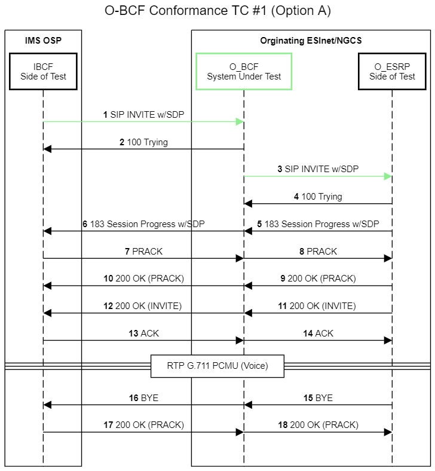

## Basic Call

### Test Case: 1

### Variation: 1

O-BCF TCP port 5061 with mutual TLS

#### Description of the use case:
This use case tests the OSP-Facing BCF (O-BCF) when providing a basic call.

-   The test system sends messages to and receives responses from the O-BCF's OSP interfaces.

-   The test system receives messages from and sends responses to the O-BCF's ESRP interfaces.

-   The tool will simulate elements on both sides of the O-BCF.

-   The base flow is a call with early media.

#### Interfaces/Functional Elements:

-   OSP-Facing BCF

#### Advance Pre-Conditions:

-   No active calls

-   Configure the BCF to route calls to the corresponding test endpoint.

-   O-BCF TCP port 5061

-   Operator of the device under test to specify what a legal uri for the route header field that will work in the environment.

-   O-BCF System Under Test has been provisioned with a cert traceable to the PCA.

-   I-BCF Side of Test has been provisioned with a cert traceable to a CA acceptable to the O-BCF System Under Test (CA on System Under Test's list or configured into it)

#### Pre-Test Sequence:

-   911 call is sent to an O-BCF by an OSP

-   Fixed origination call

#### Variations:

Variations are described in O-BCF TC1

#### Test Message Sequence:

A. I-BCF Side of Test establishes TLS connection to O-BCF System Under Test on port 5061, using mutual authentication.

1.  I-BCF Side of Test sends SIP INVITE w/SDP to the O-BCF System Under
    Test

    1.  Request-URI: urn:service:sos

    2.  Route Header field present

    3.  Geolocation Header field present

    4.  Geolocation Route Header field present

    5.  ProviderInfo & ServiceInfo provided by value

    6.  Location Passed by Value

    7.  P-Asserted-Identity present

    8.  SDP Offer: Bi-directional audio G.711, Spoken English

    9.  Legal SIP items assumed

2.  I-BCF Side of Test verifies the O-BCF System Under Test sent a 100 Trying

3.  O-ESRP Side of Test verifies the O-BCF System Under Test sent SIP INVITE w/SDP

4.  O-ESRP Side of Test sends 100 Trying to O-BCF System Under Test

5.  O-ESRP Side of Test sends 183 Session Progress to O-BCF System Under Test

    1.  SDP Answer: Bi-directional audio G.711, Spoken English

6.  I-BCF Side of Test verifies the O-BCF System Under Test sent 183 Session Progress w/SDP

7.  I-BCF Side of Test sends PRACK to O-BCF System Under Test

8.  O-ESRP Side of Test verifies the O-BCF System Under Test sent PRACK

9.  O-ESRP Side of Test sends 200 OK (PRACK) to O-BCF System Under Test

10. I-BCF Side of Test verifies the O-BCF System Under Test sent 200 OK (PRACK)

11. O-ESRP Side of Test sends 200 OK (INVITE) to O-BCF System Under Test

    1.  SDP Answer: Bi-directional audio G.711, Spoken English

12. I-BCF Side of Test verifies the O-BCF System Under Test sent 200 OK (INVITE)

13. I-BCF Side of Test sends ACK to O-BCF System Under Test

14. O-ESRP Side of Test verifies the O-BCF System Under Test sent ACK Establish RTP G.711 PCMU (Voice) per SDP

-   O-ESRP Side of Test sends pre-defined audio packets to O-BCF System Under Test.

-   I-BCF Side of Test verifies the packets received are correct.

-   I-BCF Side of Test sends pre-defined audio packets to the O-BCF System Under Test.

-   O-ESRP Side of Test verifies the packets received are correct.

15. O-ESRP Side of Test sends BYE to O-BCF System Under Test

16. I-BCF Side of Test verifies the O-BCF System Under Test sent BYE.

17. I-BCF Side of Test sends 200 OK to O-BCF System Under Test

18. O-ESRP Side of Test verifies the O-BCF System Under Test sent 200 OK.

|  | 
|:--:| 
| *Figure 1* |

#### Test Evaluation Steps:

-   Test evaluation steps are covered within the Test Message Sequence section of this document.

#### Post-Conditions:

-   No call in progress

-   Check logs, no errors observed

-   TLS Connection taken down

#### Notes:
(Left off on 11/29/2023): Brandon's suggestion\... For the purposes of testing there should be mutually acceptable roots when testing. Pick up the discussion on the hooks to a PCA and the added overhead that may come with it.
