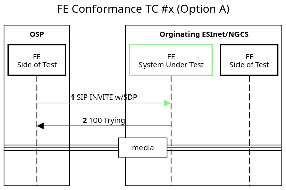

## Name

### Test Case: x

#### Description:
This use case tests the \... OSP-Facing BCF (O-BCF) when providing a basic call.

-   The test system sends messages \...

#### Interfaces/Functional Elements:

-   Facing

#### Advance Pre-Conditions:

-   No active calls

#### Pre-Test Sequence:

-   911 call is sent to \...

#### Variations:

1.  Variation A \...

2.  Variation B \...

## Test Message Sequence:

1.  Element sends SIP INVITE w/SDP to \...

Figure 1

#### Test Evaluation Steps:

-   Test evaluation steps are covered within the Test Message Sequence section of this document.

#### Post-Conditions:

-   No call in progress

-   Check logs, no errors observed

#### Notes:

To do later \...
